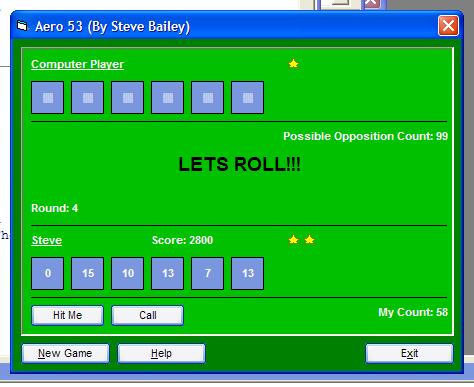



## Aero53

### Description

A not so simple number game in which you compete with the computer to see who can get closest to 53 with a random pick of numbers. confused? :P check it out, plz rate and have fun :)
 
### More Info
 
i have added one of my own button ocx controls, however i appritiate that some people dont have this control so ive placed it in the zip named 'XP_Command1.oc_'. all you need to do is rename it, then copy it to your system folder. if you dont trust it, check my other articles out (where i have posted the source for the ocx :P) hope this dosent put neone off. thx, steve

             |
---                |---
**Submitted On**   |2003-07-25 23:11:06
**By**             |[Aimee Bailey](https://github.com/Planet-Source-Code/PSCIndex/blob/master/ByAuthor/aimee-bailey.md)
**Level**          |Beginner
**User Rating**    |4.3 (13 globes from 3 users)
**Compatibility**  |VB 6\.0
**Category**       |[Games](https://github.com/Planet-Source-Code/PSCIndex/blob/master/ByCategory/games__1-38.md)
**World**          |[Visual Basic](https://github.com/Planet-Source-Code/PSCIndex/blob/master/ByWorld/visual-basic.md)
**Archive File**   |[Aero531620197252003\.zip](https://github.com/Planet-Source-Code/aimee-bailey-aero53__1-47168/archive/master.zip)

